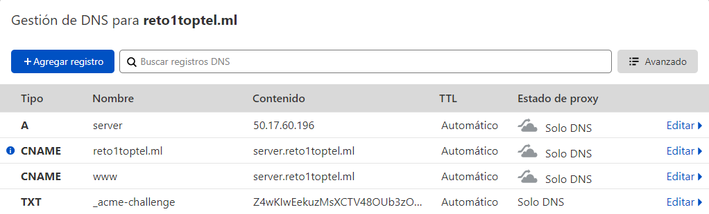

# PROYECTO 2 - TOPICOS DE TELEMATICA
## DOCUMENTACIÓN DE LA FASE DE INSTALACIÓN
### SITIO WEB: https://www.reto1toptel.ml

## Integrantes del Proyecto:
- Juan Felipe Londoño Gaviria
- Felipe Ríos López
- Juan David Pérez Sotelo

## Instalación:
# Contenido TOC 
[**Proyecto N°** **2**](#_Toc71756676)

[Creación de vpc y configuración	 ](#_Toc71756684)

[Creación de las subredes y configuración	 ](#_Toc71756685)

[Crear y configurar el Internet Gateway.	 ](#_Toc71756686)

[Security Group para los NATs Instance.	 ](#_Toc71756687)

[Crear las instancias NAT	 ](#_Toc71756688)

[NAT Instance AZ-A:	 ](#_Toc71756689)

[Security groups para Bastion Hosts.	 ](#_Toc71756690)

[Crear las instancias Bastion Hosts	 ](#_Toc71756691)

[Bastion Host AZ-A:	 ](#_Toc71756692)

[Security Group para Tráfico Web	](#_Toc71756693)

[Crear y configurar la instancia del servidor de bases de datos en la subred privada.	](#_Toc71756694)

[Crear el grupo de subred para el servicio RDS.	](#_Toc71756695)

[Crear una instancia de Amazon RDS.	 ](#_Toc71756696)

[Crear y configurar el sistema de archivos compartidos EFS	](#_Toc71756697)

[Crear y configurar la Instancia del Servidor Web Wordpress	 ](#_Toc71756698)

[Instalación de docker compose	](#_Toc71756699)

[Credenciales SSL	 ](#_Toc71756700)

[Configurar cloudflare con nuestro cname de freenom	 ](#_Toc71756701)

[Bibliografía	 ](#_Toc71756702)

#

## **Creación de vpc y configuración** 

● En la consola de AWS seleccione el servicio de VPC.

● En el panel izquierdo seleccione la opción de “Your VPCs”

● Click en Create VPC.

o Name: MyWebAPP-VPC

o IPv4 CIDR block: 172.31.0.0/16

o Click “Create VPC”

o Debe aparecer mensaje de que la VPC se ha creado de manera exitosa.

● En el panel izquierdo seleccione “Your VPCs”. Se debe visualizar la VPC por defecto y la nueva

VPC que se ha configurado con el rango de direcciones. 172.31.0.0/16.
## **Creación de las subredes y configuración** 
En la sección de VPC, en el panel izquierdo, localice la opción de “Subnets”.

● Click en “Subnets”.

● Click en “Create subnet”. Primero crearemos la subred privada y luego la pública.

o Name tag: Private Subnet A

o VPC\*: Seleccione MyWebApp-VPC

o Availability Zone: Seleccione la primera zona disponible.

o IPv4 CIDR block\*: 172.31.1.0/24

o Debe aparecer un mensaje que la subred fue creada de manera exitosa.

Otra vez, click en “Create subnet” para crear la subred privada.

o Name tag: Public Subnet A

o VPC\*: Seleccione MyWebApp-VPC

o Availability Zone: Seleccione la primera zona disponible.

o IPv4 CIDR block\*: 172.31.2.0/24

o Debe aparecer un mensaje que la subred fue creada de manera exitosa.

Otra vez, click en “Create subnet” para crear la subred privada.

o Name tag: Private Subnet B

o VPC\*: Seleccione MyWebApp-VPC

o Availability Zone: Seleccione la segunda zona disponible.

o IPv4 CIDR block\*: 172.31.3.0/24

o Debe aparecer un mensaje que la subred fue creada de manera exitosa.

Otra vez, click en “Create subnet” para crear la subred privada.

o Name tag: Public Subnet B

o VPC\*: Seleccione MyWebApp-VPC

o Availability Zone: Seleccione la segunda zona disponible.

o IPv4 CIDR block\*: 172.31.4.0/24

o Debe aparecer un mensaje que la subred fue creada de manera exitosa.
## **Crear y configurar el Internet Gateway.**

A continuación, vamos a implementar el dispositivo que permitirá enviar y recibir tráfico de Internet.

● En la sección de VPC, en el panel izquierdo, localice la opción de “Internet Gateway”.

● Click en Internet Gateways.

● Click en internet Gateway.

o Name tag: MyWebVPC-IGW

● Click en Create Internet gateway.

● Debe aparecer mensaje que el Internet Gateway fue creado de manera exitosa.

● Ahora, se debe asociar el Internet Gateway a la VPC.

● Seleccione el internet Gateway creado: MyWebApp-IGW

● Click en “Actions” y click en “Attach to VPC”.

● En Available VPCs seleccione MyWebApp-VPC.

● Click en “Attach Internet Gateway”.
## **Security Group para los NATs Instance.**

De click en “create security group”. Una vez esté creado vamos a agregar las reglas de tráfico de entrada

a este. En la pestaña de “Inbound rules”:

● Click en “Edit inbound rules”. Click “Add rule”. Configure los siguientes parámetros:

o Type: HTTP

o Source: 172.31.1.0/24

o Description: Allow inbound HTTP traffic from servers in the private subnet.

● Click en “Edit inbound rules”. Click “Add rule”. Configure los siguientes parámetros:

o Type: https

o Source: 172.31.2.0/24

o Description: Allow inbound HTTPS traffic from servers in the private subnet

● Click en “Edit inbound rules”. Click “Add rule”. Configure los siguientes parámetros:

o Type: http

o Source172.31.3.0/24

o Description: Allow inbound HTTP traffic from servers in the private subnet

● Click en “Edit inbound rules”. Click “Add rule”. Configure los siguientes parámetros:

o Type: https

o Source: 172.31.4.0/24

o Description: Allow inbound HTTPS traffic from servers in the private subnet

● Click en “Edit inbound rules”. Click “Add rule”. Configure los siguientes parámetros:

o Type: ssh

o Source: MyIP

o Description: Allow inbound SSH access to the NAT instance from your home network

(over the internet gateway)

En el servicio de VPC, escoja la opción “create security group” y configure los siguientes parámetros:

● Security group name: SG-NAT-Instance

● Description: Enable outgoing traffic from private subnet to Internet

● VPC: MyWebApp-VPC
## **Crear las instancias NAT**
En esta sección se presenta como configuraremos una instancia de NAT. Esta instancia permite enviar

tráfico de los equipos que están en la red privada hacia Internet en cada. Para esto, diríjase al “home”

de la consola de administración de AWS. Escoja el servicio de EC2. En el panel izquierdo seleccione la

opción de “Instances” seleccione la opción “launch instances” y ejecute lo siguientes pasos:
## **NAT Instance AZ-A:**

● Busque la imagen: amzn-ami-vpc-nat-hvm-2018.03.0.20181116-x86\_64-ebs

● Seleccione Amazon Linux AMI 2018.03.0.20181116 x86\_64 VPC HVM ebs. Click en select.

● Seleccione el tipo de instancia t2.micro (columna type) y click en “Next:Configure Instance

details”.

● Ahora configure, los siguientes parámetros:

o Network: MyWebAPP-VPC

o Subnet: Public Subnet A.

o Auto-assign Public IP: Enable

● Click en “Next:Add storage”.

● Click en “Next:Add tags”.

o Key: Name.

o Value: NAT-Instance.

● Click en “Next:Configure security group”:

o Seleccione la opción de un security group existente. Seleccione “SG-NAT-Instance”

● Click en “Next:Review instance and launch”.

● Click en “Launch”.

● Seleccione an existing key pair or create a new key pair.

o Seleccione el key pair que ud ha creado para el curso.

Finalmente, y, dado que es una NAT instance, para que trabaje de forma adecuada se debe detener la

característica de “source/destination checking”. Para esto realice lo siguiente:

● Seleccione el servicio de EC2. En el panel izquierdo click en instances. Click en Running instances.

● Seleccione la casilla de “NAT Instance” desplegada.

● Click en “Actions”. Click en Networking. Click en “Change source/destination check”.

● Seleccione la casilla “Stop”.

● Click en “Save”.

Crear y configurar las tablas de enrutamiento.

En esta subsección vamos a crear cuatro tablas de enrutamiento (dos por cada AZ), una asociada a cada

subred que hemos definido. Igualmente vamos a configurar que la ruta por defecto de cada una de estas

tablas de enrutamiento

● Click en “Create route table” para crear la tabla de enrutamiento para la subred privada.

o Name tag: Private Route Table A

o VPC: MyWebAPP-VPC

o Click en “create”.

● Click en “Create route table” para crear la tabla de enrutamiento para la subred pública.

o Name tag: Public Route Table A

o VPC: MyWebAPP-VPC

o Click en “create”.

● Click en “Create route table” para crear la tabla de enrutamiento para la subred privada.

o Name tag: Private Route Table B

o VPC: MyWebAPP-VPC

o Click en “create”.

● Click en “Create route table” para crear la tabla de enrutamiento para la subred pública.

o Name tag: Public Route Table B

o VPC: MyWebAPP-VPC

o Click en “create”.

Ahora se debe crear las rutas por defecto. Para el caso de la subred privada, el tráfico debe ser enviado

al NAT Gateway. Para esto en el panel izquierdo, seleccione la opción de Route Tables. Seleccione la

subred privada “Private Route Table” y abajo, en el panel de “Routes”

● Click en “Edit routes”.

● Click en “Add route”.

o Destination: 0.0.0.0/0

o Target: Seleccione la instancia del NAT Gateway (NAT-GW-Instance) que se desplegó

para cada AZ.

● Click en “Save routes”.

● Debe observar el mensaje de que la ruta se ha editado de manera exitosa.

Por otro lado, para el caso de la red pública, este tráfico debe ser enviado al Internet Gateway. Para esto

en el panel izquierdo, seleccione la opción de Route Tables. Seleccione la subred pública “Public Route

Table” y abajo, en el panel de “Routes”

● Click en “Edit routes”.

● Click en “Add route”.

o Destination: 0.0.0.0/0

o Target: Seleccione el Internet Gateway (MyWebApp-IGW).

● Click en “Save routes”.

● Debe observar el mensaje de que la ruta se ha editado de manera exitosa.

Ahora debemos asociar a cada tabla de enrutamiento, las subredes. Seleccione la “Private Route Table

A” y en la pestaña de “Subnet Associations”:

● Click en “Edit subnet associations”.

● Marque la casilla de la subred privada 172.31.1.0/24.

● Click en Save.

Ahora debemos asociar a cada tabla de enrutamiento, las subredes. Seleccione la “Private Route Table

B” y en la pestaña de “Subnet Associations”:

● Click en “Edit subnet associations”.

● Marque la casilla de la subred privada 172.31.3.0/24.

● Click en Save.

Para el caso de las subredes públicas, seleccione la “Public Route Table A” y en la pestaña de “Subnet

Associations”:

● Click en “Edit subnet associations”.

● Marque la casilla de la subred privada 172.31.2.0/24.

● Click en Save.

Ahora, seleccione la “Public Route Table B” y en la pestaña de “Subnet Associations”:

● Click en “Edit subnet associations”.

● Marque la casilla de la subred privada 172.31.4.0/24.

● Click en Save.
## **Security groups para Bastion Hosts.**
En este apartado usted creará un grupo de seguridad el cual oficiará como un firewall virtual. De esta

forma, cuando usted lance una instancia, usted asociará un o varios grupos de seguridad.

En el panel de navegación ubicado en la izquierda, en la sección de “Security”. Seleccione la opción de

“Security Groups”. Allí puede ver los diferentes “security groups” configurados. En el servicio de VPC,

escoja la opción “create security group” y configure los siguientes parámetros:

● Security group name: SG-Bastion

● Description: Enable SSH Access

● VPC: MyWebApp-VPC

De click en “create security group”. Una vez esté creado vamos a agregar las reglas de tráfico de entrada

a este. En la pestaña de “Inbound rules”:

● Click “Add rule”. Configure los siguientes parámetros:

o Type: SSH

o Source: MyIP

o Description: Allow ssh traffic
## ` `**Crear las instancias Bastion Hosts**
En esta sección crearemos una instancia EC2 la cual actuará como Host Bastion. Recuerde que esta VM

estará asociada a la subred pública de la VPC por cada zona de disponibilidad.
## **Bastion Host AZ-A:**

Diríjase al “home” de la consola de administración de AWS. Escoja el servicio de EC2. En el panel

izquierdo seleccione la opción de “Instances” seleccione la opción “launch instances” y ejecute lo

siguientes pasos:

● Escoja la imagen de Amazon Machine Image (A|MI) la cual contiene la imagen del sistema

operativo. Seleccione Amazon Linux 2 AMI (HVM), SSD Volume Type (click select).

● Seleccione el tipo de instancia t2.micro (columna type) y click. En “Next:Configure Instance

details”.

● Ahora configure, los siguientes parámetros:

o Network: MyWebAPP-VPCMyLabVPC

o Subnet: Public Subnet A.

o Auto-assign Public IP: Enable

● Click en “Next:Add storage”.

● Click en “Next:Add tags”.

o Key: Name.

o Value: Bastion Host.

● Click en “Next:Configure security group”:

o Seleccione la opción de un security group existente. Seleccione “SG-Bastion”

● Click en “Next:Review instance and launch”.

● Click en “Launch”.

● Seleccione an existing key pair or create a new key pair.

o Seleccione el key pair que ud ha creado para el curso.

Bastion Host AZ-B:

Diríjase al “home” de la consola de administración de AWS. Escoja el servicio de EC2. En el panel

izquierdo seleccione la opción de “Instances” seleccione la opción “launch instances” y ejecute lo

siguientes pasos:

● Escoja la imagen de Amazon Machine Image (AMI) la cual contiene la imagen del sistema

operativo. Seleccione Amazon Linux 2 AMI (HVM), SSD Volume Type (click select).

● Seleccione el tipo de instancia t2.micro (columna type) y click. En “Next:Configure Instance

details”.

● Ahora configure, los siguientes parámetros:

o Network: MyWebAPP-VPCMyLabVPC

o Subnet: Public Subnet B.

o Auto-assign Public IP: Enable

● Click en “Next:Add storage”.

● Click en “Next:Add tags”.

o Key: Name.

o Value: Bastion Host.

● Click en “Next:Configure security group”:

o Seleccione la opción de un security group existente. Seleccione “SG-Bastion”

● Click en “Next:Review instance and launch”.

● Click en “Launch”.

● Seleccione an existing key pair or create a new key pair.

o Seleccione el key pair que ud ha creado para el curso.

## **Security Group para Tráfico Web**
Escoja la opción “create security group” y configure los siguientes parámetros:

● Security group name: SG-Web

● Description: Enable HTTP Access

● VPC: MyWebApp-VPC

De click en “create security group”.

Una vez esté creado vamos a agregar las reglas de tráfico de entrada a este. En la pestaña de “Inbound

rules”, click en “Edit inbound rules” y click en “add rule”. Configure los siguientes parámetros:

● Type: HTTP

● Source: Anywhere

● Description: Permit Web Requests

● Type: HTTPS

● Source: Anywhere

● Description: Permit HTTPS Requests

● Type: SSH

● Source: Anywhere //Preferiblemente ssh SÓLO desde los bastion. 172.31.2.0/24. 172.31.4.0/24.

● Description: Permit SSH Requests

● Type: NFS

● Source: Anywhere

● Description: Permit NFS Requests for EFS

Click “Create security group”.

o Security Group para Servicio Relacional de Bases de Datos.

En el servicio de VPC, escoja la opción “create security group” y configure los siguientes parámetros:

● Security group name: SG-RDS-DB

● Description: Permit Access from web security group.

● VPC: MyWebApp-VPC

De click en “create security group”. Una vez esté creado vamos a agregar las reglas de tráfico de entrada

a este. En la pestaña de “Inbound rules”:

● Click en “Edit inbound rules”. Click “Add rule”. Configure los siguientes parámetros:

● Click “Add rule”. Configure los siguientes parámetros:

o Type: MySQL/Aurora

o Source: Custom. Digite sg y seleccione el security group creado para web.

o Description: Allow DB connection

De esta forma se configura el security group de la bases de datos para aceptar las peticiones entrantes

sobre el puerto 3306 desde cualquier instancia EC2 que esté asociada con ese security group.
## ` `**Crear y configurar la instancia del servidor de bases de datos en la subred privada.**
## **Crear el grupo de subred para el servicio RDS.**
Antes que cualquier y con el fin de emplear el servicio de RDS, se debe crear un subnet group el cual es

usado para decirle a la bases de datos cuales subredes pueden ser usadas por ésta. Cada subnet group

de bases de datos, requiere tener subredes al menos en dos zonas de disponibilidad (AZ).

● En la sección de servicios, escoja RDS.

● En el panel de configuración izquierda, click en Subnet Groups.

● Click en Create DB Subnet Group y configure los siguientes aspectos:

o Name: DB-Subnet Group.

o Description: Subnet group for RDS.

o VPC: MyWebbApp-VPC

● Baje hasta la sección que permita adicionar las subredes.

● Despliegue la lista de valores de subredes y seleccione las subredes asociadas con los rangos

172.31.1.0/24 y 172.31.3.0 /24.

● Click en create.

Este grupo de subred de bases de datos va a ser utilizado para desplegar el motor de bases de datos.
## **Crear una instancia de Amazon RDS.**
En esta sección se procederá a desplegar una instancia de bases de datos de MySql en un entorno de

múltiples zonas de disponibilidad. Cuando se lanza este servicio, de manera automática amazon crea

una instancia principal de la bases de datos y sincroniza los datos con una estancia secundaria que

despliega en una zona de disponibilidad diferente en la cual desplegó la primera instancia.

En la consola de gestión, seleccione el servicio de RDS. En el panel izquierdo, click en Databases.

● Click Create database.

● Click en el método Standard create.

● Seleccione el motor de bases de datos MySQL.

● Seleccione free tier como template.

● En la sección de settings.

o DB instance identifier: wordpress

o Master username: jjf

o Master password: Retotopicos1\*

o Confirm password: Retotopicos1\*

● En la sección de DB instance size:

o DB instance class: seleccione burstable classes (includes t classes).

o Seleccione db.t2.micro.

● En la sección Storage, configure:

o Storage type: General purpose (SSD).

o Allocated storage: 20

● En la sección de Availability y durability:

o Multi-AZ deployment. Seleccione a standby instance (recommender for production

usage).

● En la sección de Connectivity

o Virtual Private Cloud: (VPC): MyWebApp-VPC.

o Expanda la opción para Additional connectivity configuration:

▪ Selecciona las zonas de disponibilidad y subredes para el despliegue de la base

de datos. Recuerde que esta va ubicada en la subred privada.

o Public access: Click en No.

o Existing VPC security groups: Seleccione el security group definido para la BD.

● En la sección de Database authentication:

o Seleccione Password authentication.

● Expanda la opción para Additional configuration:

o Initial database name: wordpress.

o No marque la opción de “enable automatic backups”

o No marque la opción de “enable enhanced monitoring”

● Click en create database. En este momento su bases de datos va a ser desplegada. Tomará unos

5 mins en ser desplegada.
## **Crear y configurar el sistema de archivos compartidos EFS**
En esta sección se presenta como crearemos un sistema de archivos EFS que será compartido por todas

las instancias del Servidor Web/PHP (wordpress). Este sistema de archivos permite compartir todos los

archivos de la aplicación wordpress así como todos los archivos estáticos que normalmente maneja un

servidor CMS (imágenes, pdfs, videos, sonidos, y en general muchos otros tipos de archivos). Para esto,

diríjase al “home” de la consola de administración de AWS. Escoja el servicio de EFS.

En el panel izquierdo seleccione la opción de “File Systems” seleccione la opción “Create file system” y

ejecute lo siguientes pasos:

● Name - optional: WP-EFS

● Virtual Private Cloud: (VPC): MyWebApp-VPC

● Availability and Durability: Regional

● Click. Create

Una vez creado en sistema de archivos, hacer Click en WP-EFS y realice los siguientes cambios:

● Click en “Network”

● Click en “Manage”

○ Borre en “Security groups” con la X el grupo de seguridad creado por defecto. Haga esto

por cada zona de disponibilidad.

○ Adicione en “Security groups” en cada zona de disponibilidad:

■ Seleccione “Web Security Group”

○ Click: Save

Obtener la dirección IP del punto de montaje: (\*+\*)

● Le damos Click en WP-EFS (fs-f168b545)

● Click en: Attach

● Seleccione: Mount vía IP

● Anote la &lt;dirección-IP WP-EFS&gt; del punto de montaje para actualizarlo en la instancia del Web

Wordpress

● Listo
## **Crear y configurar la Instancia del Servidor Web Wordpress**
En esta sección crearemos una instancia EC2 la cual actuará como Web Server. Recuerde que esta VM

estará asociada a la subred privada a la VPC. Esta instancia será creada para servir como Imagen AMI

más adelante en el Autoscaling Group.

Diríjase al “home” de la consola de administración de AWS. Escoja el servicio de EC2. En el panel

izquierdo seleccione la opción de “Instances” seleccione la opción “launch instances”. Escoja la imagen

de Amazon Machine Image (AMI) la cual contiene la imagen del sistema operativo. Seleccione Amazon

Linux 2 AMI (HVM), SSD Volume Type (click select). Seleccione el tipo de instancia t2.micro (columna

type) y click “configure instance details”. Ahora configure, los siguientes parámetros:

● Network: MyLabVPC

● Subnet: Private Subnet A

● Auto-assign Public IP: disable

● File systems: Click en “Add file system”

o Seleccionar el EFS Creado anteriormente (WP-EFS)

o Como ruta en vez de /mnt/efs/fs1 -&gt; coloque /mnt/efs/wordpress

o Des-seleccionar la opción: Automatically create and attach the required security groups.

● Click en “Add storage”.

● Click en “Add tags”.

o Key: Name.

o Value: Web Server.

● Click en “Configure security group”:

o Seleccione la opción de un security group existente. Seleccione “Web Security Group”

● Click en “Review and launch”.

A continuación, nos iremos para la máquina “Web Server” en la qué probaremos la concurrencia con el simple comando de “more docker-compose.yml” que se crea a continuación en el siguiente pasó y en /etc/fstab, en ambas la ruta debe marcar a /mnt/efs/wordpress, adicionalmentw a esto en el archivo de /etc/fstab debe marcar correctamente la IP del servicio EFS de Amazon que es arrojada cuando le das la opción montar via IP. Recordar que para este paso debemos verificar que hayamos ejecutado los siguientes comandos para instalación de herramientas: “sudo yum install –y amazon-efs-utils" y “sudo yum install –y nfs-utils". Al hacer el docker-compose up y comprobar con docker ps, encontraremos el sistema EFS con el tamaño disponible corriendo.
## **Instalación de docker compose** 

sudo curl -L https://github.com/docker/compose/releases/download/1.27.4/docker-compose-`uname -s`-

`uname -m` -o /usr/local/bin/docker-compose

sudo chmod +x /usr/local/bin/docker-compose

// utilizar este docker-compose.yml:

[ec2-user@ip-172-16-1-64 ~]$ sudo nano docker-compose.yml

version: 3.1;

services:

wordpress:

image: wordpress

restart: always

ports:

\- 80:80

environment:

WORDPRESS\_DB\_HOST: dns-url-rdsdns-url-rds

WORDPRESS\_DB\_USER: jjf

WORDPRESS\_DB\_PASSWORD: Retotopicos1\*

WORDPRESS\_DB\_NAME: wordpress

volumes:

\- /mnt/efs/wordpress:/var/www/html

volumes:

wordpress:

Nota: Debe actualizarse el valor el valor de dns-url-rds al real de la base de datos MySQL del anterior numeral (4.10)

## **Credenciales SSL**

sudo amazon-linux-extras install epel -y

sudo yum install certbot-nginx -y

sudo yum install nginx -y

sudo yum install python-certbot-nginx

sudo yum update

sudo certbot --server <https://acme-v02.api.letsencrypt.org/directory> -d \*.**reto1toptel.ml** --manual --preferred-challenges dns-01 certonly

Create a config file sudo mkdir /etc/nginx/sites-available

Open the file sudo nano/etc/nginx/sites-available/reto1toptel.ml

server {
  listen 80;
  listen [::]:80;
  server\_name \*.**reto1toptel.ml**;
  return 301 [https://$host$request_uri]();
}server {
  listen 443 ssl;
  server\_name \*.**reto1toptel.ml**;  ssl\_certificate /etc/letsencrypt/live/ **reto1toptel.ml** fullchain.pem;
  ssl\_certificate\_key /etc/letsencrypt/live/ **reto1toptel.ml** /privkey.pem;
  include /etc/letsencrypt/options-ssl-nginx.conf;
  ssl\_dhparam /etc/letsencrypt/ssl-dhparams.pem;  root /var/www/**example.com**;
  index index.html;
  location / {
  try\_files $uri $uri/ =404;
}
}

sudo service reload nginx

En el listener de load balanced se importa las claves de wild card

Add listener

Add listener

## **Configurar cloudflare con nuestro cname de freenom** 

Al entrar a cloudflare y poner nuestro cname, cloudflare nos pide que eliminemos los server default de freenom y pongamos los de cloudflare quedando así:

Configuración de server en freenom

*Figura  SEQ Figura \\* ARABIC 6*

Configuración de dns en cloudFlare

## **Plugins de wordpress** 

Una vez instalado wordpress pasaremos a buscar los plugins y a instalarlos para esto entramos a nuestro wordpress como admin y vamos a las opciones plugins y añadir nuevo

Buscaremos estos plugins que fue lo que utilizamos

- BP Better Messages

Este plugin nos permite mejorar la interfaz del envoi de mensajes a nuestros amigos y nos permite editar y responder mensajes enviados, este plugin con solo activarlo comienza a funcionar 

- BP Profile Search

Nos permite buscar a personas registradas en nuestra cuenta a traves de los parametros que nosotros escojamos, para esto debemos crear una nueva pagina copiando su shortcode en la pagina y así los usuarios tendran una página para poder buscar a los usuarios registrados

- BuddyPress

Este es el plugin más importante ya que con ese haremos nuestra comunidad que permita crear grupos y  es la plantilla que utilizaremos 

- BuddyPress Simple Eventes

Nos permite crear eventos y para su activación es en apariencia widgets, para la configuración nos metemos a plugins, nuestro plugins instalados y  ahí lo seleccionamos para configurarlo 

- MiniOrange SSO using SAML 2.0

Nos permite en ingreso de usuarios a traves de AUTH0  para esto nos vamos a la opción de apariencia widgets buscamos AUTH0 y selecionamos en donde queremos que este úbicado que en nuestro caso seria en el pie de página

- rtMedia for WordPress, BuddyPress and bbPress

Este plugin nos permite subir contenido a nuestro grupo, como fotos y videos, audios, para el contenido de documentos nos tocaria instalar la version de pago
#
# **Bibliografía**
#
ADDIN Mendeley Bibliography CSL\_BIBLIOGRAPHY [1]	K. JUEll, “Cómo instalar WordPress con Docker Compose | DigitalOcean,” Jan. 09, 2020. https://www.digitalocean.com/community/tutorials/how-to-install-wordpress-with-docker-compose-es (accessed Apr. 17, 2021).

